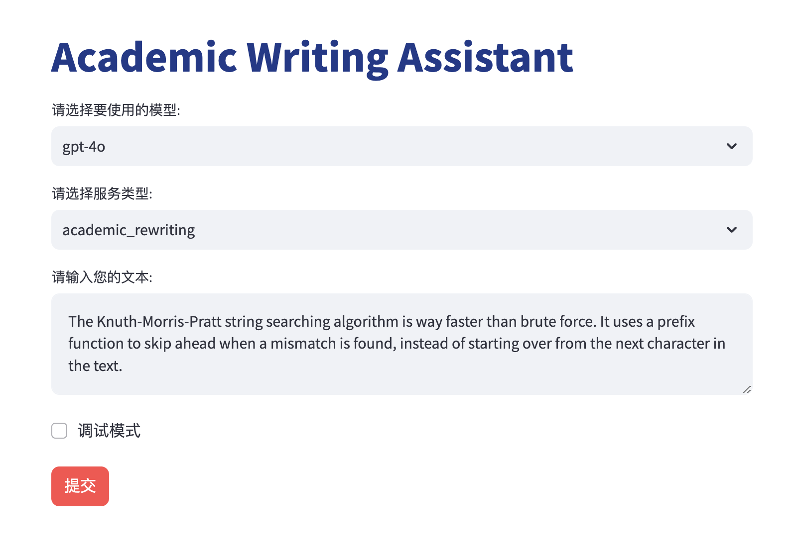
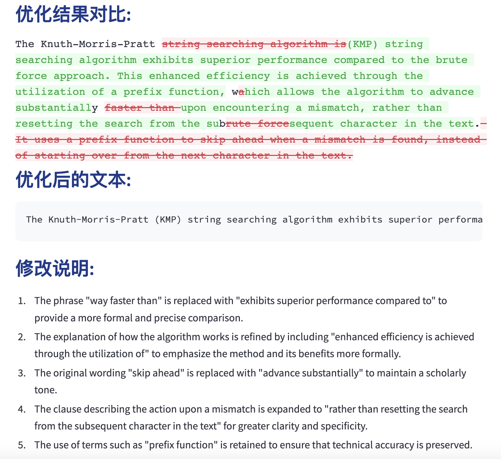

# Academic Writing Assistant

[](LICENSE)
[](https://www.python.org/downloads/release/python-380/)
[](https://streamlit.io)

**Academic Writing Assistant** 是一款基于 AI 的学术写作辅助工具，旨在帮助研究人员和学生提升学术写作质量，通过集成多个主流大语言模型 (LLM)，提供高效、定制化的写作建议。

## ✨ 主要特性

- **🧠 多模型支持**: 基于 [litellm](https://github.com/BerriAI/litellm) 集成多种主流 LLM API，灵活选择最适合的模型。
- **✍️ 高亮修改**: 直观展示原文与优化后文本的差异，提升可读性与易用性。
- **🔍 详细解释**: 提供 AI 修改的具体理由，帮助深入理解优化逻辑与方法。
- **🎯 自定义 Prompt**: 根据个人需求定制专属 prompt，满足不同写作场景的需求。

## 🖼️ 演示

<div style="display: flex; justify-content: space-around;">
  
  
</div>

## 🚀 快速开始

### 安装

1. **克隆仓库**:

   ```bash
   git clone https://github.com/Theigrams/Academic-Writing-Assistant.git
   ```

2. **安装依赖**:

   ```bash
   pip install -r requirements.txt
   ```

### 运行

1. **启动应用**:

   ```bash
   streamlit run app.py
   ```

2. **在浏览器中访问显示的 URL** (通常为 `http://localhost:8501`)

3. **配置 API 和 Prompt**

> 💡 **Tip**: 当开启「调试模式」时，您可以编辑当前的 prompt，但该 prompt 不会保存。

## 🛠️ 贡献

我们欢迎各种贡献，尤其是关于 prompts 的优化。如果您有自己的 prompts 想法或改进建议，请提交 PR 一起完善这个项目。

## 📄 许可证

本项目采用 [MIT 许可证](LICENSE)。
